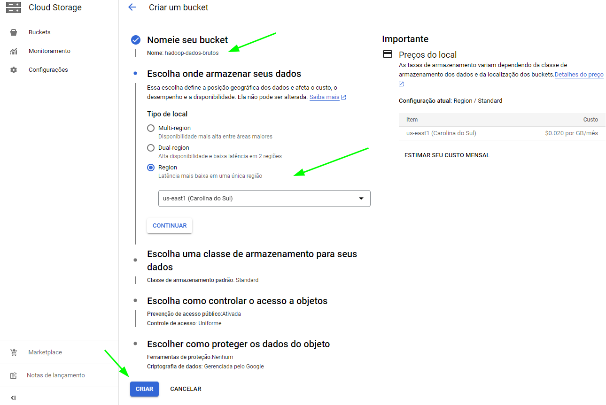
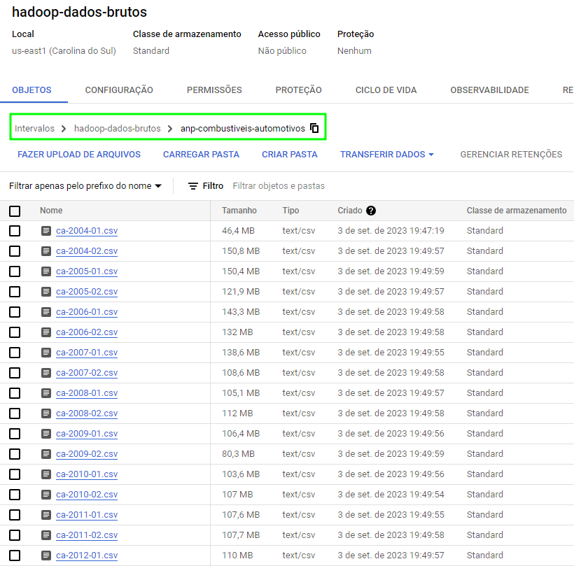
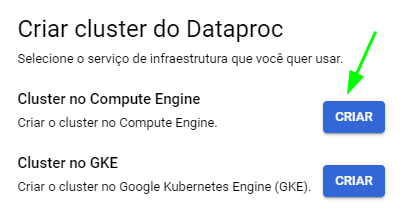
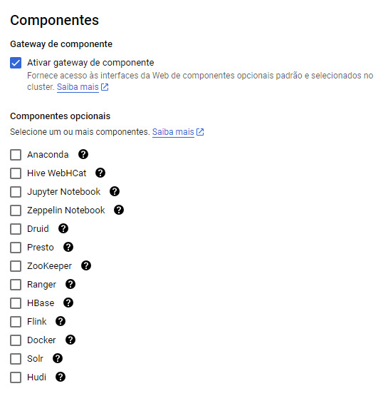
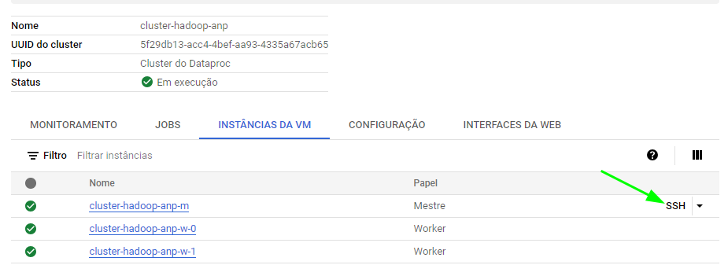

# hadoop-precos-combustiveis

Projeto HADOOP em Google Cloud para dados de preços de combustíveis da ANP

O trabalho faz uso de dados publicados pela ANP (Agência Nacional de Petróleo)

> Em cumprimento às determinações da Lei do Petróleo (Lei nº 9478/1997, artigo 8º), a ANP acompanha os preços praticados por revendedores de combustíveis automotivos e de gás liquefeito de petróleo envasilhado em botijões de 13 quilos (GLP P13), por meio de uma pesquisa semanal de preços realizada por empresa contratada.

- [Série Histórica de Preços de Combustíveis e de GLP](https://www.gov.br/anp/pt-br/centrais-de-conteudo/dados-abertos/serie-historica-de-precos-de-combustiveis)

Coletamos a série histórica de "Combustíveis automotivos" que vai de 2004 a 2023. São 39 arquivos CSV totalizando aproximadamente 3.7 GB.

- [Metadados em PDF](https://www.gov.br/anp/pt-br/centrais-de-conteudo/dados-abertos/arquivos/shpc/metadados-serie-historica-precos-combustiveis-1.pdf)

Temos as seguintes colunas no CSV, em conformidade com a documentação de metadados:

- Regiao - Sigla
- Estado - Sigla
- Municipio
- Revenda
- CNPJ da Revenda
- Nome da Rua
- Numero Rua
- Complemento
- Bairro
- Cep
- Produto
- Data da Coleta
- Valor de Venda
- Valor de Compra
- Unidade de Medida
- Bandeira
```

A princípio não vamos trabalhar com os dados de GLP.

## 1. Storage no Google Cloud

Criamos um bucket de nome `hadoop-dados-brutos` em uma região padrão (us-east1).



Os arquivos do site da ANP foram descompactados e renomeados para um padrão `ca-<ano>-<semestre>.csv`.

Fizemos o upload dos arquivos para a pasta `anp-combustiveis-automotivos` do bucket.



## 2. Cluster Hadoop para processamento dos dados

Para o processamento dos dados com o Hadoop, vamos usar o serviço Dataproc do Google Cloud

> Dataproc is a fully managed and highly scalable service for running Apache Hadoop, Apache Spark, Apache Flink, Presto, and 30+ open source tools.



- Nome: cluster-hadoop-anp
- Local: us-east1
- Tipo de Cluster: Padrão (1 mestre, N workers)

Há princípio não vamos usar nenhum componente extra.



Para o nó do administrador, visando otimização de custo, selecionamos uma máquina padrão de menor capacidade, embora fosse possível customizar para um tamanho ainda menor.

> Contém o YARN Resource Manager, HDFS NameNode e todos os drivers do job.

- Série: N1
- Tipo de máquina: n1-standard-2 (2 vCPU, 7.5 GB de memória)
- Disco de 166 GB SSD

Para os nós de trabalho, o mesmo padrão de máquina

> Cada um contém um YARN NodeManager e um HDFS DataNode. O fator de replicação de HDFS é 2.

- Série: N1
- Tipo de máquina: n1-standard-2 (2 vCPU, 7.5 GB de memória)
- Disco de 166 GB SSD
- Number of worker nodes: 2

Os discos ficaram com tamanho 166 GB pois a soma dos 3 deve ser menor do que a quota de 500 GB da conta do Google Cloud.

Todas as outras configurações do cluster ficaram com preenchimento / seleção padrão.

Quando o cluster for criado com sucesso é possível acessar a máquina principal via SSH



## 3. Acesso ao bucket

O acesso ao bucket criado no passo 1 pode ser feito por uma ferramenta de nome GCSFUSE, que faz o mapeamento (montagem) do bucket como uma pasta no sistema de arquivos local.

Comando para instalação da ferramenta:

```
############ Instalação do GCSFUSE #######################
####### GCSFUSE é uma aplicação que permite que você monte um 'bucket' do GCP no sistema de arquivos da sua VM
####### Dessa forma, ao fazer upload de arquivos para o bucket você pode utilizá-los dentro da VM
export GCSFUSE_REPO=gcsfuse-`lsb_release -c -s`
echo "deb http://packages.cloud.google.com/apt $GCSFUSE_REPO main" | sudo tee /etc/apt/sources.list.d/gcsfuse.list
curl https://packages.cloud.google.com/apt/doc/apt-key.gpg | sudo apt-key add -
sudo apt-get update
sudo apt-get install gcsfuse
```

O comando para fazer a montagem é `gcsfuse <bucket-name> <local-dir>`. O utilitário espera que a pasta esteja criada.

```
mkdir ./dados-brutos
gcsfuse hadoop-dados-brutos ./dados-brutos

I0904 00:10:57.440104 2023/09/04 00:10:57.440062 Start gcsfuse/1.1.0 (Go version go1.20.5) for app "" using mount point: /home/<username>/dados-brutos
```

Listando os arquivos:

```
cd ./dados-brutos/anp-combustiveis-automotivos
ls

ca-2004-01.csv  ca-2005-02.csv  ca-2007-01.csv  ca-2008-02.csv  ca-2010-01.csv  ca-2011-02.csv  ca-2013-01.csv  ca-2014-02.csv  ca-2016-01.csv  ca-2017-02.csv  ca-2019-01.csv  ca-2020-02.csv  ca-2022-01.csv ...
```

## 4. Interagindo com o HDFS

O comando `hdfs dfs` é um atalho para execução de comandos sobre o Hadoop File System (HDFS). 

Listando o conteúdo da raiz e da pasta `/user`:

```
hdfs dfs -ls /

Found 3 items
drwxrwxrwt   - hdfs hadoop          0 2023-09-03 23:26 /tmp
drwxrwxrwt   - hdfs hadoop          0 2023-09-03 23:25 /user
drwxrwxrwt   - hdfs hadoop          0 2023-09-03 23:25 /var
```

```
hdfs dfs -ls /user

Found 11 items
drwxrwxrwt   - hdfs hadoop          0 2023-09-03 23:25 /user/dataproc
drwxrwxrwt   - hdfs hadoop          0 2023-09-03 23:25 /user/hbase
drwxrwxrwt   - hdfs hadoop          0 2023-09-03 23:25 /user/hdfs
drwxrwxrwt   - hdfs hadoop          0 2023-09-03 23:25 /user/hive
drwxrwxrwt   - hdfs hadoop          0 2023-09-03 23:25 /user/mapred
drwxrwxrwt   - hdfs hadoop          0 2023-09-03 23:25 /user/pig
drwxrwxrwt   - hdfs hadoop          0 2023-09-03 23:25 /user/solr
drwxrwxrwt   - hdfs hadoop          0 2023-09-03 23:25 /user/spark
drwxrwxrwt   - hdfs hadoop          0 2023-09-03 23:25 /user/yarn
drwxrwxrwt   - hdfs hadoop          0 2023-09-03 23:25 /user/zeppelin
drwxrwxrwt   - hdfs hadoop          0 2023-09-03 23:25 /user/zookeeper
```

## 5. Subindo os dados brutos para o HDFS

Criamos uma pasta `/data` e subimos a pasta `./dados-brutos/anp-combustiveis-automotivos` com todo o conteúdo

```
hdfs dfs -mkdir /data
hdfs dfs -put ./dados-brutos/anp-combustiveis-automotivos  /data
hdfs dfs -ls /data
```

Checando a listagem de arquivos no HDFS:

```
hdfs dfs -ls /data/anp-combustiveis-automotivos

Found 39 items
-rw-r--r--   2 <username> hadoop   48637859 2023-09-04 00:24 /data/anp-combustiveis-automotivos/ca-2004-01.csv
-rw-r--r--   2 <username> hadoop  158110155 2023-09-04 00:24 /data/anp-combustiveis-automotivos/ca-2004-02.csv
-rw-r--r--   2 <username> hadoop  157737721 2023-09-04 00:24 /data/anp-combustiveis-automotivos/ca-2005-01.csv
-rw-r--r--   2 <username> hadoop  127779846 2023-09-04 00:24 /data/anp-combustiveis-automotivos/ca-2005-02.csv
```

## 6. Criando o schema de dados no Hive

Idéia é criar uma visão de dados no Hive para os dados que subimos no Hadoop e realizar consultas e processamentos sobre estes dados.

Para a interação com o Hive usamos a ferramenta Beeline

```
beeline -u jdbc:hive2://localhost:10000/default

Connecting to jdbc:hive2://localhost:10000/default
Connected to: Apache Hive (version 3.1.3)
Driver: Hive JDBC (version 3.1.3)
Transaction isolation: TRANSACTION_REPEATABLE_READ
Beeline version 3.1.3 by Apache Hive
0: jdbc:hive2://localhost:10000/default> 
```

Criamos primeiro a nossa base de dados:

```sql
create database if not exists precos_anp
comment 'Base de dados de preços de combustíveis fornecidos pela ANP e alguns indicadores de mercado';
```

O resultado sugere que foi criada a base de dados

```
INFO  : Compiling command(queryId=hive_20230904010015_1b26f610-62d0-446e-aba0-fb0c7f9f8c65): create database if not exists precos_anp
comment 'Base de dados de preços de combustíveis fornecidos pela ANP e alguns indicadores de mercado'
INFO  : Concurrency mode is disabled, not creating a lock manager
INFO  : Semantic Analysis Completed (retrial = false)
INFO  : Returning Hive schema: Schema(fieldSchemas:null, properties:null)
INFO  : Completed compiling command(queryId=hive_20230904010015_1b26f610-62d0-446e-aba0-fb0c7f9f8c65); Time taken: 0.648 seconds
INFO  : Concurrency mode is disabled, not creating a lock manager
INFO  : Executing command(queryId=hive_20230904010015_1b26f610-62d0-446e-aba0-fb0c7f9f8c65): create database if not exists precos_anp
comment 'Base de dados de preços de combustíveis fornecidos pela ANP e alguns indicadores de mercado'
INFO  : Starting task [Stage-0:DDL] in serial mode
INFO  : Completed executing command(queryId=hive_20230904010015_1b26f610-62d0-446e-aba0-fb0c7f9f8c65); Time taken: 0.251 seconds
INFO  : OK
INFO  : Concurrency mode is disabled, not creating a lock manager
No rows affected (1.179 seconds)
```

Podemos consultar os metadados

```sql
describe database extended precos_anp;
```

Uma tabela é retornada com as propriedades da base de dados:

- db_name: precos_anp
- comment: Base de dados de preços de combustíveis fornecidos pela ANP e alguns indicadores de mercado
- location: hdfs://cluster-hadoop-anp-m/user/hive/warehouse/precos_anp.db
- owner_type: anonymous
- parameters: USER

A nossa tabela de dados brutos terá um schema baseado no conteúdo dos nossos arquivos CSV que já estão no HDFS.

Por enquanto consideramos todos os campos como STRING.

O uso do formato SERDE é necessário pois encontramos alguns registros onde o valor de uma coluna pode ocupar várias linhas, usando neste caso o caractére `"` como marcador de início e fim.

```
use precos_anp;

create table combustiveis_automotivos (
    regiao STRING COMMENT 'Região do país (sigla)',
    estado STRING  COMMENT 'Estado do país (sigla)',
    municipio STRING COMMENT 'Nome do município',
    revenda STRING COMMENT 'Nome social do revendedor de combustível',
    cnpj_revenda STRING COMMENT 'CNPJ do revendedor',
    endereco_rua STRING COMMENT 'Nome da rua',
    endereco_numero STRING COMMENT 'Número na rua',
    endereco_complemento STRING COMMENT 'Complemento do endereço',
    endereco_bairro STRING COMMENT 'Nome do bairro',
    endereco_cep STRING COMMENT 'Código Postal',
    produto STRING COMMENT 'Nome do produto (ex: ETANOL, DIESEL, GASOLINA, etc.)',
    data STRING COMMENT 'Data da coleta (dd/mm/yyyy)',
    valor_venda STRING COMMENT 'Valor da venda (formato brasileiro)',
    valor_compra STRING COMMENT 'Valor da compra (formato brasileiro)',
    unidade_medida STRING COMMENT 'Unidade de medida (ex: R$ / litro)',
    bandeira STRING COMMENT 'Nome da bandeira do revendedor'
)
row format serde 'org.apache.hadoop.hive.serde2.OpenCSVSerde'
with serdeproperties (
  "separatorChar" = ";",
  "quoteChar"     = "\""
)
fields terminated by ';'
stored as textfile
tblproperties("skip.header.line.count"="1");
```

Confirmando a criação da tabela:

```sql
describe table extended combustiveis_automotivos
```

```
+-----------------------+------------+----------------------------------------------------+
|       col_name        | data_type  |                      comment                       |
+-----------------------+------------+----------------------------------------------------+
| regiao                | string     | Região do país (sigla)                             |
| estado                | string     | Estado do país (sigla)                             |
| municipio             | string     | Nome do município                                  |
| revenda               | string     | Nome social do revendedor de combustível           |
| cnpj_revenda          | string     | CNPJ do revendedor                                 |
| endereco_rua          | string     | Nome da rua                                        |
| endereco_numero       | string     | Número na rua                                      |
| endereco_complemento  | string     | Complemento do endereço                            |
| endereco_bairro       | string     | Nome do bairro                                     |
| endereco_cep          | string     | Código Postal                                      |
| produto               | string     | Nome do produto (ex: ETANOL, DIESEL, GASOLINA, ... |
| data                  | string     | Data da coleta (dd/mm/yyyy)                        |
| valor_venda           | string     | Valor da venda (formato brasileiro)                |
| valor_compra          | string     | Valor da compra (formato brasileiro)               |
| unidade_medida        | string     | Unidade de medida (ex: R$ / litro)                 |
| bandeira              | string     | Nome da bandeira do revendedor                     |
+-----------------------+------------+----------------------------------------------------+
```

## 7. Carregando os dados

Usamos o comando 'load data' para transferir os dados em CSV para o nosso schema criado.

```sql
load data inpath '/data/anp-combustiveis-automotivos' overwrite into table combustiveis_automotivos
```

```
...
INFO  : Executing command(queryId=hive_20230904013527_a1e0a2b4-f30a-4bdb-a636-378fca0cb1bb): load data inpath '/data/anp-combustiveis-automotivos' overwrite into table combustiveis_automotivos
INFO  : Loading data to table precos_anp.combustiveis_automotivos from hdfs://cluster-hadoop-anp-m/data/anp-combustiveis-automotivos
No rows affected (1.055 seconds)
```

Verificando se temos dados na tabela `combustiveis_automotivos`

```
select count(*) from combustiveis_automotivos
```

```
----------------------------------------------------------------------------------------------
        VERTICES      MODE        STATUS  TOTAL  COMPLETED  RUNNING  PENDING  FAILED  KILLED  
----------------------------------------------------------------------------------------------
Map 1 .......... container     SUCCEEDED      6          6        0        0       0       0  
Reducer 2 ...... container     SUCCEEDED      1          1        0        0       0       0  
----------------------------------------------------------------------------------------------
VERTICES: 02/02  [==========================>>] 100%  ELAPSED TIME: 23.97 s    
----------------------------------------------------------------------------------------------
INFO  : Completed executing command(queryId=hive_20230904013619_0f8b7571-e728-47ee-b94f-ab5a5bf239f1); Time taken: 44.727 seconds
+-----------+
|    _c0    |
+-----------+
| 22645940  |
+-----------+
1 row selected (47.726 seconds)
```

Temos cerca de 23 milhões de registros.

Verificando o quantitativo de registros por `produto`

```sql
select produto, count(*) from combustiveis_automotivos group by produto;
```

```
----------------------------------------------------------------------------------------------
        VERTICES      MODE        STATUS  TOTAL  COMPLETED  RUNNING  PENDING  FAILED  KILLED  
----------------------------------------------------------------------------------------------
Map 1 .......... container     SUCCEEDED      6          6        0        0       0       0  
Reducer 2 ...... container     SUCCEEDED    156        156        0        0       0       0  
----------------------------------------------------------------------------------------------
VERTICES: 02/02  [==========================>>] 100%  ELAPSED TIME: 168.34 s   
----------------------------------------------------------------------------------------------
INFO  : Completed executing command(queryId=hive_20230904020550_44081b4b-b4f7-4e57-9c4e-5aaf4703ea4a); Time taken: 179.732 seconds
INFO  : OK
+----------------------------------------------------+----------+
|                      produto                       |   _c1    |
+----------------------------------------------------+----------+
| DIESEL S10                                         | 1978185  |
| DIESEL S50                                         | 44495    |
| DIESEL                                             | 5406872  |
| GNV                                                | 435900   |
| ETANO                                              | 1        |
| GASOLINA                                           | 7457216  |
| ETANOL                                             | 6896581  |
| GASOLINA ADITIVADA                                 | 426690   |
+----------------------------------------------------+----------+
8 rows selected (182.242 seconds)
```

Os tempos de consulta parecem altos pois estamos trabalhando em um formato de dados não otimizado.

Temos um registro com o nome de produto `ETANO` quando deveria ser `ETANOL`. Podemos corrigir em uma outra etapa.

Saindo do `beeline` para verificar o HDFS, podemos ver que a pasta `/data`` se encontra vazia.

```
hdfs dfs -ls /data
```

Enquanto a pasta de localização da tabela `combustiveis_automotivos` contém os arquivos CSV.

O comando `load data` fez a migração dos arquivos.

```
hdfs dfs -ls /user/hive/warehouse/precos_anp.db/combustiveis_automotivos
Found 39 items
-rw-r--r--   2 <username> hadoop   48637859 2023-09-04 00:24 /user/hive/warehouse/precos_anp.db/combustiveis_automotivos/ca-2004-01.csv
-rw-r--r--   2 <username> hadoop  158110155 2023-09-04 00:24 /user/hive/warehouse/precos_anp.db/combustiveis_automotivos/ca-2004-02.csv
-rw-r--r--   2 <username> hadoop  157737721 2023-09-04 00:24 /user/hive/warehouse/precos_anp.db/combustiveis_automotivos/ca-2005-01.csv
...
```

## 8. Otimizando a tabela de dados

Idéia é migrar os dados para uma tabela mais otimizada para as consultas que executarmos.

Escolhemos o formato ORC por entender que é mais amigável ao Hadoop.

- [Tipos de arquivos em Bigdata](https://medium.com/rescuepoint/tipos-de-dados-em-bigdata-6ab0debec30a)

> O projeto do ORC nasceu em 2013 como uma iniciativa de acelerar o Hive e reduzir armazenamento no Hadoop.

Adotamos a compressão SNAPPY por ser menos custosa em termos de CPU, dado que não estamos lidando com um volume tão grande de dados.

Inicialmente pensamos em fazer a partição por `produto` e `estado` para otimizar o processamento ao realizar filtros e agrupamentos sobre estes campos.

> In Hadoop, partitioning is used to split data into smaller chunks, which are then distributed across multiple nodes in a cluster for processing.
> Partitioning works better when the cardinality of the partitioning field is not too high.

Há um limite para o número de partições. Apesar de ser configurável, seria melhor evitar um número alto de partições.

> The maximum number of dynamic partitions is controlled by hive.exec.max.dynamic.partitions and hive.exec.max.dynamic.partitions.pernode. Maximum was set to 100 partitions per node.

Consideramos então particionar a tabela somente pelo campo `produto`.

Usamos a compartimentação (bucketing) por `data` para otimizar a combinação dos dados (JOIN) com outras séries históricas.

> Bucketing works well when the field has high cardinality and data is evenly distributed among buckets. 

- [HIVE PARTITIONING VS. BUCKETING](https://data-flair.training/forums/topic/hive-partitioning-vs-bucketing/)

Com isso chegamos nesse schema para a tabela `combustiveis_automotivos_otimizada` 

```
use precos_anp;

create table combustiveis_automotivos_otimizada (
  regiao STRING,
  estado STRING,
  municipio STRING,
  revenda STRING,
  cnpj_revenda STRING,
  endereco_rua STRING,
  endereco_numero STRING,
  endereco_complemento STRING,
  endereco_bairro STRING,
  endereco_cep STRING,
  data DATE,
  valor_venda DECIMAL(10,4),  -- Tipo decimal com até 4 casas decimais
  valor_compra DECIMAL(10,4),  -- Tipo decimal com até 4 casas decimais
  unidade_medida STRING,
  bandeira STRING
)
partitioned by (produto STRING)
clustered by (data) into 8 buckets
stored as orc
tblproperties ("orc.compress"="SNAPPY");
```

```
show tables;

+-------------------------------------+
|              tab_name               |
+-------------------------------------+
| combustiveis_automotivos            |
| combustiveis_automotivos_otimizada  |
+-------------------------------------+
```

```
describe combustiveis_automotivos_otimizada;

+--------------------------+----------------+----------+
|         col_name         |   data_type    | comment  |
+--------------------------+----------------+----------+
| regiao                   | string         |          |
| estado                   | string         |          |
| municipio                | string         |          |
| revenda                  | string         |          |
| cnpj_revenda             | string         |          |
| endereco_rua             | string         |          |
| endereco_numero          | string         |          |
| endereco_complemento     | string         |          |
| endereco_bairro          | string         |          |
| endereco_cep             | string         |          |
| data                     | date           |          |
| valor_venda              | decimal(10,4)  |          |
| valor_compra             | decimal(10,4)  |          |
| unidade_medida           | string         |          |
| bandeira                 | string         |          |
| estado                   | string         |          |
| produto                  | string         |          |
|                          | NULL           | NULL     |
| # Partition Information  | NULL           | NULL     |
| # col_name               | data_type      | comment  |
| produto                  | string         |          |
+--------------------------+----------------+----------+
```

Uma vez criada a tabela otimizada, podemos inserir os registros a partir da tabela de dados brutos, fazendo também a conversão e correção de campos.

```
use precos_anp;

insert overwrite table combustiveis_automotivos_otimizada 
select
  regiao,
  estado,
  municipio,
  revenda,
  cnpj_revenda,
  endereco_rua,
  endereco_numero,
  endereco_complemento,
  endereco_bairro,
  endereco_cep,
  cast(regexp_replace(data, '^(\\d{2})/(\\d{2})/(\\d{4})$', '$3-$2-$1') as date) as data,
  cast(replace(valor_venda, ',', '.') as decimal(10,4)) as valor_venda,
  cast(replace(valor_compra, ',', '.') as decimal(10,4)) as valor_compra,
  unidade_medida,
  bandeira,
  case 
    when produto = 'ETANO' then 'ETANOL'
    else produto
  end as produto
from combustiveis_automotivos;
```

Em caso de `Out of Memory`, fazer a inserção por partes usando o `insert into` com cláusula `where` para inserir um conjunto de dados por vez.

Refazendo a contagem de registros por produto

```
select produto, count(*) from combustiveis_automotivos_otimizada group by produto;
```

```
+---------------------+----------+
|       produto       |   _c1    |
+---------------------+----------+
| DIESEL S50          | 44495    |
| DIESEL              | 5406872  |
| GASOLINA            | 7457216  |
| ETANOL              | 6896582  |
| GNV                 | 435900   |
| DIESEL S10          | 1978185  |
| GASOLINA ADITIVADA  | 426690   |
+---------------------+----------+
7 rows selected (23.448 seconds)
```

A consulta executou consideravelmente mais rápido na nova tabela.

Checando o conteúdo da tabela no HDFS verificamos que cada partição fica em uma pasta

```
hdfs dfs -ls /user/hive/warehouse/precos_anp.db/combustiveis_automotivos_otimizada

Found 7 items
drwxr-xr-x   - anonymous hadoop          0 2023-09-04 04:48 /user/hive/warehouse/precos_anp.db/combustiveis_automotivos_otimizada/produto=DIESEL
drwxr-xr-x   - anonymous hadoop          0 2023-09-04 04:43 /user/hive/warehouse/precos_anp.db/combustiveis_automotivos_otimizada/produto=DIESEL S10
drwxr-xr-x   - anonymous hadoop          0 2023-09-04 04:48 /user/hive/warehouse/precos_anp.db/combustiveis_automotivos_otimizada/produto=DIESEL S50
drwxr-xr-x   - anonymous hadoop          0 2023-09-04 05:01 /user/hive/warehouse/precos_anp.db/combustiveis_automotivos_otimizada/produto=ETANOL
drwxr-xr-x   - anonymous hadoop          0 2023-09-04 05:06 /user/hive/warehouse/precos_anp.db/combustiveis_automotivos_otimizada/produto=GASOLINA
drwxr-xr-x   - anonymous hadoop          0 2023-09-04 05:18 /user/hive/warehouse/precos_anp.db/combustiveis_automotivos_otimizada/produto=GASOLINA ADITIVADA
drwxr-xr-x   - anonymous hadoop          0 2023-09-04 04:57 /user/hive/warehouse/precos_anp.db/combustiveis_automotivos_otimizada/produto=GNV
```

E dentro de cada pasta temos 8 buckets com tamanhos parecidos, em acordo com o esperado.

```
hdfs dfs -ls /user/hive/warehouse/precos_anp.db/combustiveis_automotivos_otimizada/produto=DIESEL

Found 8 items
-rw-r--r--   2 anonymous hadoop   15494126 2023-09-04 04:48 /user/hive/warehouse/precos_anp.db/combustiveis_automotivos_otimizada/produto=DIESEL/000000_0
-rw-r--r--   2 anonymous hadoop    9358828 2023-09-04 04:48 /user/hive/warehouse/precos_anp.db/combustiveis_automotivos_otimizada/produto=DIESEL/000001_0
-rw-r--r--   2 anonymous hadoop    9610799 2023-09-04 04:48 /user/hive/warehouse/precos_anp.db/combustiveis_automotivos_otimizada/produto=DIESEL/000002_0
-rw-r--r--   2 anonymous hadoop    9142598 2023-09-04 04:48 /user/hive/warehouse/precos_anp.db/combustiveis_automotivos_otimizada/produto=DIESEL/000003_0
-rw-r--r--   2 anonymous hadoop    8739530 2023-09-04 04:48 /user/hive/warehouse/precos_anp.db/combustiveis_automotivos_otimizada/produto=DIESEL/000004_0
-rw-r--r--   2 anonymous hadoop    9195491 2023-09-04 04:48 /user/hive/warehouse/precos_anp.db/combustiveis_automotivos_otimizada/produto=DIESEL/000005_0
-rw-r--r--   2 anonymous hadoop   10241446 2023-09-04 04:48 /user/hive/warehouse/precos_anp.db/combustiveis_automotivos_otimizada/produto=DIESEL/000006_0
-rw-r--r--   2 anonymous hadoop    9465032 2023-09-04 04:48 /user/hive/warehouse/precos_anp.db/combustiveis_automotivos_otimizada/produto=DIESEL/000007_0
```
